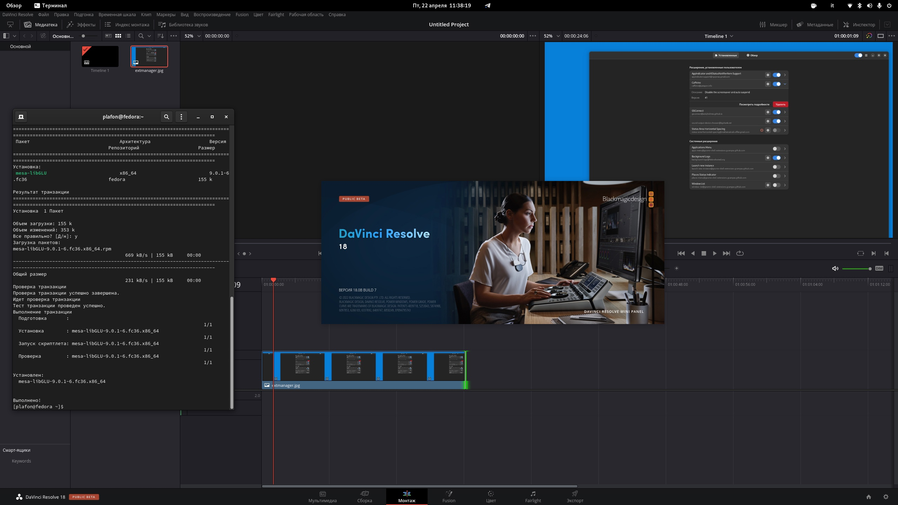

# DaVinci Resolve

<figure><figcaption></figcaption></figure>

## Качаем и устанавливаем сам DaVinci Resolve

<figure><figcaption></figcaption></figure>



Распаковываем скачанный архив

```bash
cd ~/Downloads
```

```bash
unzip DaVinci_Resolve_18.0.4_Linux.zip
```

Устанавливаем DaVinci Resolve 18

```bash
./DaVinci_Resolve_18.0.4_Linux.run -i
```


Для ребят с видеокартами от NVIDIA на этом всё. Приятного творчества!


## ДЛЯ ВИДЕОКАРТ AMD RADEON

### Доустанавливаем этот пакет:

```bash
sudo dnf install rocm-opencl
```


Теперь всё и для лагеря "красных"! Приятного творчества и нам :tada::clap:


<figure><figcaption><p>Видеокарта AMD Radeon отображается корректно в Fedora Linux</p></figcaption></figure>

Проверяем всё ли работает утилитой `clinfo`

```bash
sudo dnf install clinfo
```

```bash
clinfo
```

```bash
Number of platforms                               1
  Platform Name                                   AMD Accelerated Parallel Processing
  Platform Vendor                                 Advanced Micro Devices, Inc.
  Platform Version                                OpenCL 2.1 AMD-APP (3452.0)
  Platform Profile                                FULL_PROFILE
  Platform Extensions                             cl_khr_icd cl_amd_event_callback 
  Platform Extensions function suffix             AMD
  Platform Host timer resolution                  1ns

  Platform Name                                   AMD Accelerated Parallel Processing
Number of devices                                 1
  Device Name                                     gfx1010:xnack-
  Device Vendor                                   Advanced Micro Devices, Inc.
  Device Vendor ID                                0x1002
  Device Version                                  OpenCL 2.0 
  Driver Version                                  3452.0 (HSA1.1,LC)
  Device OpenCL C Version                         OpenCL C 2.0 
  Device Type                                     GPU
  Device Board Name (AMD)                         AMD Radeon RX 5700 XT
  Device PCI-e ID (AMD)                           0x731f
  Device Topology (AMD)                           PCI-E, 0000:0c:00.0
  Device Profile                                  FULL_PROFILE

................
```


## Возможные ошибки

В Fedora 37 необходимо доустановить эту библиотеку

```bash
sudo dnf install mesa-libGLU
```

В Fedora 38 если выдает подобную ошибку:

<figure><figcaption></figcaption></figure>

```bash
sudo cp /usr/lib64/libglib-2.0.so.0 /opt/resolve/libs/
```

### Если DaVinci Resolve 18.5 не запускается на Fedora 38 и выдаёт подобную ошибку:

> /opt/resolve/bin/resolve: symbol lookup error: /lib64/libpango-1.0.so.0: undefined symbol: g\_string\_free\_and\_steal

Попробуйте это, мне помогло:

```bash
sudo cp /usr/lib64/libglib-2.0.so.0 /opt/resolve/libs/
```
