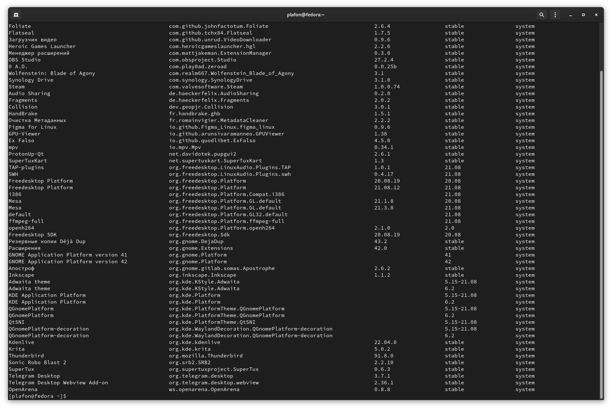

# Flatpak

### Управление Flatpak приложениями

<figure><figcaption></figcaption></figure>

Обновить все Flatpak приложения:

```bash
flatpak update
```

Посмотреть список приложений Flatpak:

```bash
flatpak list
```

Удалить Flatpak приложение:

```
flatpak remove org.название.приложения
```

Удалить неиспользуемые библиотеки:

```bash
flatpak remove --unused
```

Удаление папки и конфигов с каталога `/var`

```bash
flatpak remove --delete-data
```
