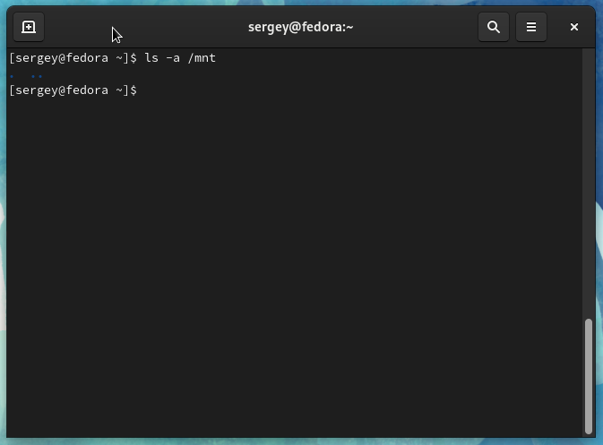
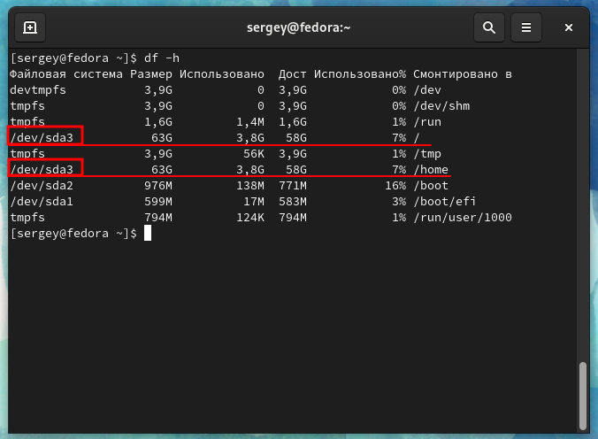
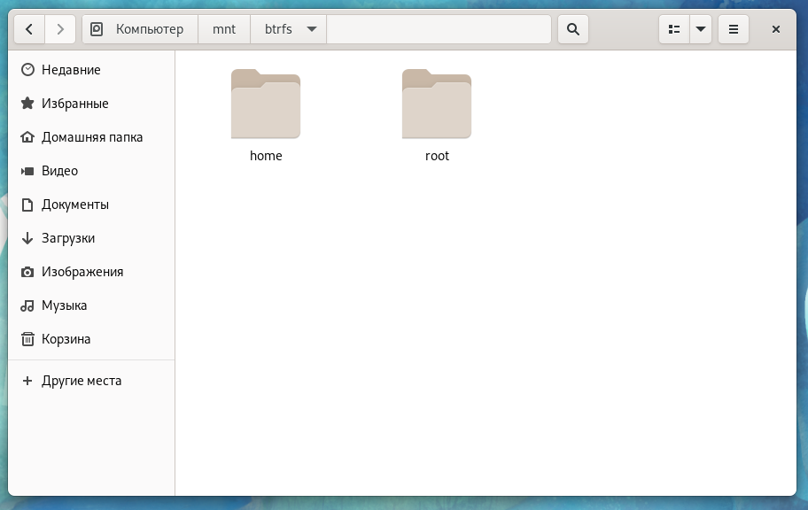
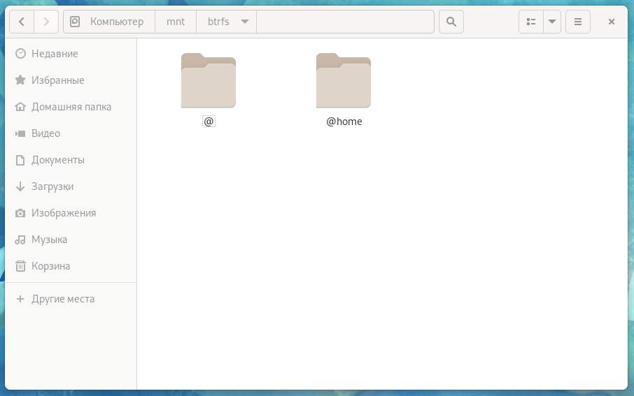
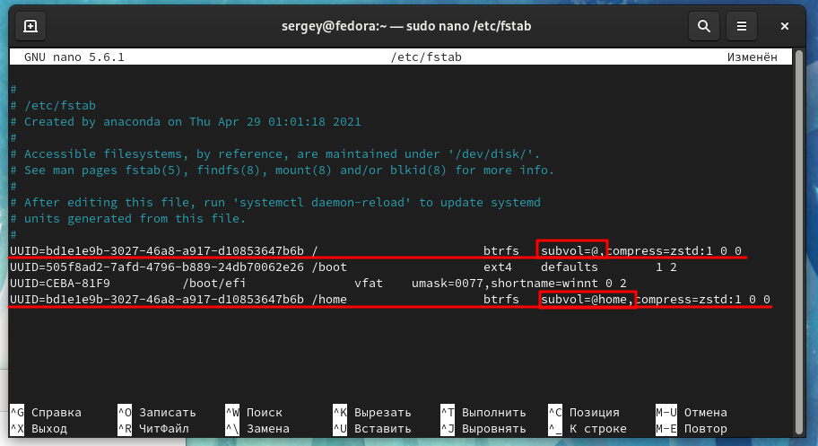
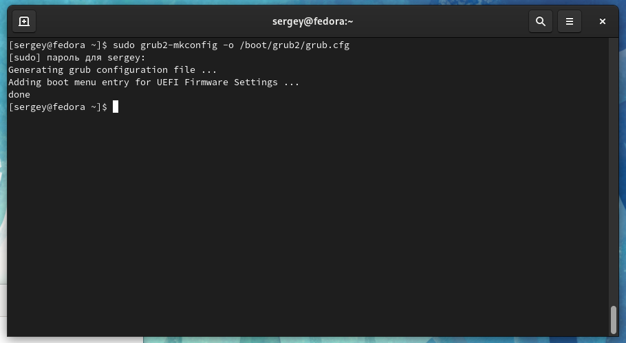
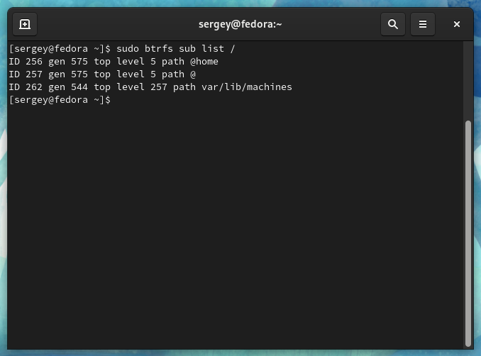

# Настраиваем BTRFS subvolumes

Монтируем файловую систему


Первым делом проверяем чтобы в вашей системе не было ничего примонтировано в директории `/mnt`


```bash
ls -a /mnt
```

<figure><figcaption></figcaption></figure>

Если в директории уже что-то примонтировано, то просто нужно создать новую директорию и монтировать в нее.&#x20;

Например:

```bash
sudo mkdir /mnt/btrfs
```


В этом руководстве все команды будут выполнены с учетом того, что была создана директория `btrfs`


Дальше нужно определить на какое устройство установлена система:

```bash
df -h
```

<figure><figcaption></figcaption></figure>

Теперь монтируем файловую систему (c учетом ваших результатов):

```bash
sudo mount /dev/sda3 /mnt/btrfs
```


Если открыть примонтированую директорию через файловый менеджер, то будут видны примонтированные подразделы (subvolume).


<figure><figcaption></figcaption></figure>

## Перенос подразделов

Теперь приступаем к переносу подразделов:

```bash
sudo mv /mnt/btrfs/root /mnt/btrfs/@
```

```bash
sudo mv /mnt/btrfs/home /mnt/btrfs/@home
```

<figure><figcaption></figcaption></figure>

## Затем правим `fstab`:

```bash
sudo vim /etc/fstab
```


Меняем root нa @ , а /home на @home


<figure><figcaption></figcaption></figure>


Сохраняем Ctrl+O , выходим Ctrl+X


Обновляем GRUB (обязательно!)

```bash
sudo grub2-mkconfig -o /boot/grub2/grub.cfg
```

<figure><figcaption></figcaption></figure>

## Размонтируем файловую систему

Сбросим все данные с хэша в файловую систему:

```bash
sync
```

Размонтируем файловую систему:

```bash
sudo umount -r /mnt/btrfs
```


Теперь можно перезагрузить ПК


Командой `sudo btrfs sub list /` можно посмотреть какие подразделы у нас в данный момент.

<figure><figcaption></figcaption></figure>


ТЕПЕРЬ, КСТАТИ, БУДЕТ ПОЛНОЦЕННО РАБОТАТЬ TIMESHIFT

