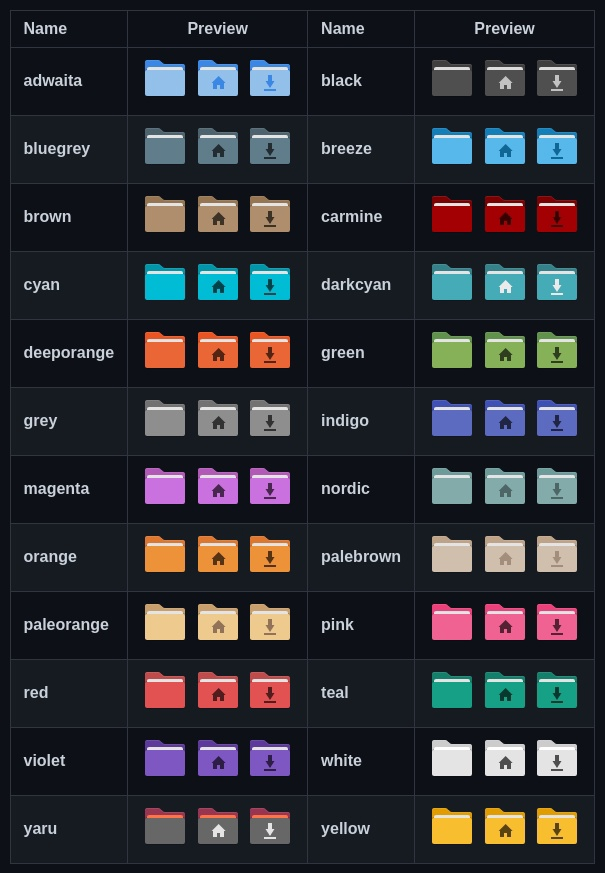

# Цветные папки

<figure><figcaption></figcaption></figure>

```bash
wget -qO- https://git.io/papirus-folders-install | sh
```

### Меняем стиль иконок, выбрав нужное **название** из таблицы:

<figure><figcaption></figcaption></figure>

```
papirus-folders -C adwaita --theme Papirus-Dark
```

### Узнать какой стиль применен сейчас в системе:

```
papirus-folders -l --theme Papirus-Dark
```

### Вернуть дефолтные папки:

```
papirus-folders -D --theme Papirus-Dark
```
