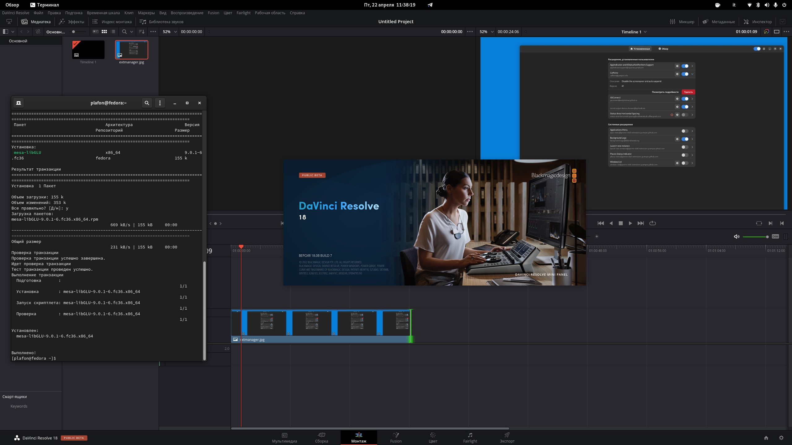

# DaVinci Resolve

<figure><figcaption></figcaption></figure>

## Подготовка системы

Устанавливаем проприетарный OpenCL в Fedora

```bash
git clone https://github.com/sukhmeetbawa/OpenCL-AMD-Fedora.git
```

```bash
cd ./OpenCL-AMD-Fedora
```

```bash
./opencl-amd.sh
```


Выбираем _**lastest**_ и жмём _**Ввод**_


Проверяем всё ли работает утилитой `clinfo`

```bash
sudo dnf install clinfo
```

```bash
clinfo
```

Далее устанавливаем недостающую либу: `mesa-libGLU`

```bash
sudo dnf install mesa-libGLU
```


Перезапускаем ПК


## Теперь качаем и устанавливаем сам DaVinci Resolve





