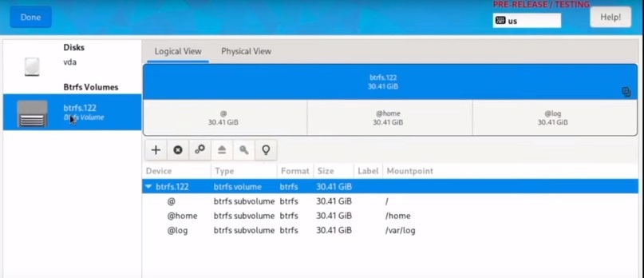

# Разметка диска


Всем пользователям, настоятельно рекомендуется использовать автоматическую разметку в установщике Fedorа Linux (Anaconda).



Будьте внимательны! Автоматическая установка полностью "затирает" диск куда будет устанавливаться система!


### Как установить Fedora в дуалбуте с Windows?



### Ручная разметка Fedora Linux



### Для того чтобы заработал Timeshift


Чтобы всё заработало правильно, необходимо настроить правильно при ручной разметке в Blivet-GUI subvolumes для btrfs (порядок создания снизу-вверх!)


<figure><figcaption></figcaption></figure>

```
@log /var/log
@home /home
@ /
```
