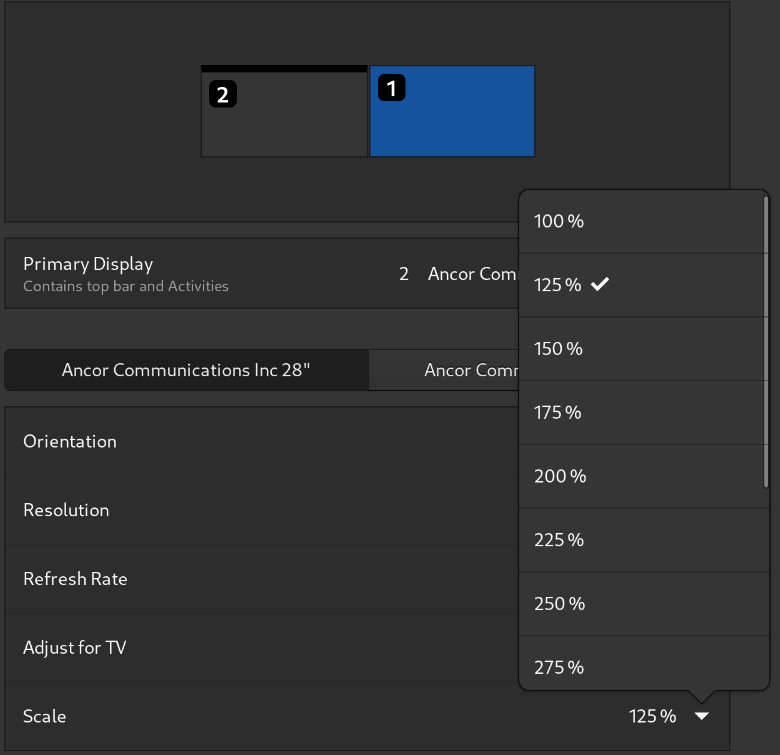

# Включаем дробное масштабирование

<figure><figcaption></figcaption></figure>

```bash
gsettings set org.gnome.mutter experimental-features “[‘scale-monitor-framebuffer’]”
```


Но включение дробного масштабирования, может привести к "мыльной" картинке, поэтому лично я увeличиваю "коэффициент масштабирования" самого текста в [Gnome Tweaks](https://plafon.gitbook.io/fedora-zero/fedora-zero/v-samom-nachale-.../dop.-nastroiki-gnome).


<figure><figcaption></figcaption></figure>
