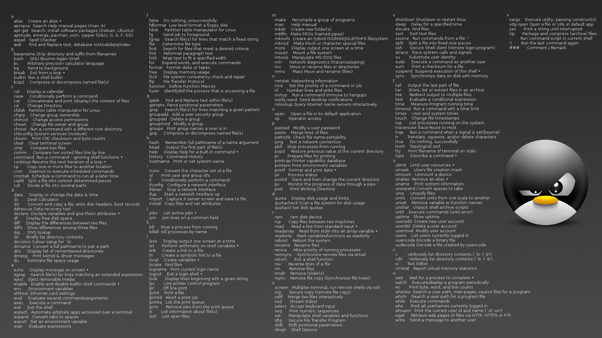

# Консольные команды для GNU/Linux

<figure><figcaption>
Шпаргалка консольных команд для Линукса
</figcaption></figure>

<figure><figcaption>
Немного команд на русском языке
</figcaption></figure>

### Да поможет вам ....&#x20;

### Навигация по файловой системе

При навигации по файловой системе в Linux можно использовать как _абсолютный_, так и _относительный_ пути к ресурсу.

_Абсолютный_ (или _полный)_ _путь_ начинается с корневого каталога, обозначаемого символом `/`, а _относительный путь_ начинается с текущего каталога (в котором в данный момент работает пользователь).

#### Команда pwd

**Команда pwd** (от англ. _«**p**resent **w**orking **d**irectory»_) позволяет узнать, в каком каталоге вы находитесь в данный момент:

`$ pwd`

Результатом будет путь к текущему рабочему каталогу:

`/home/diego`

#### Команда cd

**Команда cd** (от англ. _«**c**hange **d**irectory»_) используется для смены текущего рабочего каталога. При использовании без каких-либо параметров, команда `cd` перенесет вас в ваш домашний каталог:

`$ cd`

Чтобы перейти в другой каталог, вы можете использовать абсолютный или относительный путь. Например, перейти в папку _Downloads_, расположенную в текущем каталоге, можно как через относительный путь:

`$ cd Downloads`

Так и через абсолютный путь:

`$ cd /home/diego/Downloads`

Две точки `..` обозначают родительский каталог или каталог уровнем выше текущего. Предположим, что в данный момент вы находитесь в каталоге _/usr/local/bin_. Чтобы перейти в каталог _/usr/local_ (на один уровень выше текущего каталога), необходимо ввести:

`$ cd ../`

Чтобы подняться на два уровня вверх:

`$ cd ../../`

Чтобы вернуться к предыдущему рабочему каталогу, используйте символ тире `–` в качестве опции:

`$ cd -`

Если каталог, который вы хотите изменить, имеет пробелы в своем имени, то вы должны либо взять путь в кавычки, либо использовать символ обратной косой черты `\`:

`$ cd имя\ каталога\ с\ пробелами`

### Работа с файлами и каталогами

\

#### Команда ls

**Команда ls** (от англ. _«**l**i**s**t»_) выводит информацию о файлах и каталогах внутри заданного каталога. При использовании без параметров, данная команда отобразит в алфавитном порядке список имен всех файлов в текущем рабочем каталоге:

`$ ls`

Чтобы вывести содержимое конкретного каталога, достаточно указать путь к этому каталогу в качестве параметра:

`$ ls /usr`

По умолчанию, команда `ls` отображает только имена файлов и каталогов. Для более подробного вывода применяется опция `-l`:

`$ ls -l /etc/hosts`

Выходные данные будут содержать информацию о типе файла, разрешениях, количестве ссылок на него, владельце, группе, размере, дату и имя файла:

`-rw-r--r-- 1 root root 337 Oct  4 11:31 /etc/hosts`

По умолчанию, команда `ls` не показывает скрытые файлы (файлы, имена которых начинаются с точки `.`). Чтобы отобразить все файлы, включая скрытые, используйте опцию `-a`:

`$ ls -a ~/`

Для вывода списка всех файлов в подкаталогах используйте опцию `-R`:

`$ ls -R /usr`

#### Команда file

[**Файлы в Linux**](https://ravesli.com/tipy-fajlov-v-linux/) не обязаны всегда иметь расширения для того, чтобы с ними можно было работать. Поэтому пользователю иногда трудно определить, что за файл перед ним. **Команда file** помогает решить данную проблему, отображая информацию о типе файла на основе его содержания:

`$ file /etc/fstab`

Результат:

`/etc/fstab: ASCII text`

Команда `file` может работать и с директориями, например:

`$ file /tmp/`

Результат:

`/tmp/: sticky, directory`

#### Команда touch

**Команда touch** используется для создания новых пустых файлов, а также для обновления временных меток в уже существующих файлов и каталогов.

Чтобы создать новый файл, используйте команду `touch` с именем (создаваемого) файла в качестве параметра:

`$ touch file.txt`

Если файл уже существует, команда `touch` изменит отметку о времени последнего доступа (или изменения) к нему.

#### Команда mkdir

**Команда mkdir** (от англ. _«**m**a**k**e **dir**ectory»_) позволяет создавать новые каталоги. Для этого укажите имя каталога в качестве параметра:

`$ mkdir /tmp/newdir`

В качестве параметров команда `mkdir` может принимать одно или несколько имен каталогов. Если параметром является имя каталога без полного пути, то новый каталог создастся в текущем рабочем каталоге.

Для создания родительских каталогов используется опция `-p`:

`$ mkdir -p Projects/ravesli.com/src/assets/images`

Вышеприведенная команда создаст полную структуру каталогов.

При использовании команды `mkdir` с опцией `-p`, она создает каталог только в том случае, если он изначально отсутствует.

#### Команда rmdir

**Команда rmdir** (от англ. _«**r**e**m**ove **dir**ectory»_) используется для удаления (только) пустых каталогов:

`$ rmdir /tmp/mydir`

#### Команда ln

**Команда ln** (от англ. _«**l**i**n**k»_) используется для создания символьных ссылок. Символьная ссылка — это особый тип файла, который указывает на другой файл или каталог. Чтобы создать символьную ссылку, используйте команду `ln -s`, указывая имя файла в качестве первого параметра и имя символьной ссылки в качестве второго параметра:

`$ ln -s имя_файла имя_ссылки`

Если в качестве параметра указан только файл, команда `ln` создаст в текущем рабочем каталоге ссылку на этот файл с тем же именем, что у файла.

#### Команда rm

**Команда rm** (от англ. _«**r**e**m**ove»_) используется для удаления файлов и каталогов. При указании без параметров данная команда удаляет только файлы. Стоит отметить, что при этом команда не запрашивает у пользователя подтверждения на продолжение удаления файлов.

Чтобы удалить файл или символьную ссылку, используйте команду `rm` и имя файла в качестве параметра:

`$ rm file.txt`

Также в качестве параметров допускается указывать одно или несколько имен файлов или каталогов.

Опция `-i` указывает команде `rm` запрашивать у пользователя подтверждение перед удалением файла:

`$ rm -i file.txt`

Результат:

`rm: удалить пустой обычный файл 'file.txt'?`

Опция `-d` используется для удаления одного или нескольких пустых каталогов:

`$ rm -d mydir`

Чтобы рекурсивно удалить непустые каталоги и все файлы в них, используйте опцию `-r` (от англ. _«**r**ecursive»_):

`$ rm -rf mydir`

Опция `-f` указывает команде `rm` никогда не запрашивать подтверждения у пользователя и игнорировать несуществующие файлы.

_**Примечание**_**:** Будьте очень осторожны с командой `rm -rf` и дважды проверьте, в каком каталоге вы находитесь, т.к. вызов `rm -rf` безвозвратно (и без дополнительного подтверждения) удалит все файлы и папки из него.

#### Команда cp

**Команда** **cp** (от англ. _«**c**o**p**y»_) позволяет копировать файлы и каталоги. Чтобы скопировать файл в текущий рабочий каталог, используйте исходный файл в качестве первого параметра, а новый файл — в качестве второго:

`$ cp file file_backup`

Чтобы скопировать файл в другой каталог, укажите абсолютный или относительный путь к целевому каталогу. Если в качестве места назначения указано только имя каталога, то скопированный файл будет иметь то же имя, что и исходный файл.

`$ cp file.txt /backup`

По умолчанию, если файл назначения существует, он будет перезаписан.

Чтобы скопировать каталог, вместе с его файлами и подкаталогами, используйте опцию `-R` или `-r`:

`$ cp -R Pictures /opt/backup`

#### Команда mv

**Команда mv** (от англ. _«**m**o**v**e»_) используется для перемещения файлов и каталогов из одного места в другое, а также для переименования файлов. Например, чтобы переместить файл _file.txt_ в каталог _/tmp_, вы должны выполнить:

`$ mv file.txt /tmp`

Чтобы переименовать файл, необходимо указать имя целевого файла, а затем его новое имя:

`$ mv file.txt file1.txt`

Синтаксис перемещения каталогов такой же, как и при перемещении файлов. Чтобы одновременно переместить несколько файлов и каталогов, укажите конечный каталог в качестве последнего параметра:

`$ mv file.tx1 file1.txt /tmp`

#### Команда tar

**Команда tar** является наиболее часто используемой командой для объединения нескольких файлов в один _**\*.tar**_-архив — распространенный формат файлов Linux (похожий на формат ._zip)_, причем процедура сжатия для него не является обязательной.

Предположим, что нам нужно создать ._tar_-архив каталога _/etc_, для этого необходимо использовать следующую команду:

`$ tar -cvf myarchive.tar /etc`

Опция `-c` указывает команде `tar` на то, что мы создаем _.tar_-файл, опция `-v` отображает список обрабатываемых файлов, а опция `-f` применяется для указания имени архивного файла.

Если вы хотите добавить файл к уже существующему ._tar_-архиву, то вместо опции `-c` используется опция `-r`. Например, давайте добавим к нашему архиву _myarchive.tar_ файл _/etc/fstab_:

`$ tar -rvf myarchive.tar /etc/fstab`

_**Примечание**_**:** К уже сжатому ._tar_-файлу добавить новый файл или каталог не получится.

Извлечение в текущую папку файлов и каталогов из архивного файла выполняется с помощью опции `-x`:

`$ tar -xvf myarchive.tar`

Опция `-C` дает пользователю возможность самостоятельно указывать путь для извлекаемых файлов:

`$ tar -xvf myarchive.tar -C /tmp/`

#### Команды zip и unzip

**Команда zip** применяется для сжатия файлов в ._zip_-архив, а **команда unzip** — для извлечения заархивированных файлов из ._zip_-архива.

Чтобы создать архив из нескольких файлов, просто укажите имя создаваемого архива и перечислите список помещаемых в него файлов:

`$ zip newarchive.zip file1 file2 file3`

Если вы хотите сжать каталог вместе с вложенными в него файлами, то необходимо использовать опцию `-r`:

`$ zip –r newarchive.zip /home/diego/mydocs/`

Также, цифрами от **0** (без сжатия, быстро) до **9** (максимальное сжатие, медленно) вы можете указывать степень сжатия будущего архива. По умолчанию, используется 6-й уровень сжатия:

`$ zip -9 –r newarchive.zip /home/diego/mytxtfiles/`

Для извлечения содержимого архива в текущий каталог используется команда `unzip`:

`$ unzip myarchive.zip`

Опция `-d` позволяет распаковать содержимое архива в указанную папку, например:

`$ unzip myarchive.zip –d /tmp/`

#### Команда find

**Команда find** выполняет поиск файлов и каталогов в заданном каталоге. Например, следующая команда будет искать файл с именем _notes.txt_ в каталоге _/home_ и его подкаталогах:

`$ find /home/ -name notes.txt`

#### Команда df

**Команда** **df** (от англ. _«**d**isk **f**ree»_) используется для получения отчета об использовании дискового пространства системы, отображаемого в процентах и килобайтах. Если вы хотите просмотреть отчет в мегабайтах, используйте:

`$ df -m`

#### Команда du

**Команда du** (от англ. _«**d**isk **u**sage»_) используется для проверки того, сколько места занимает указанный файл или каталог. Чтобы увидеть занимаемое дисковое пространство в байтах, килобайтах или мегабайтах, добавьте опцию `-h`:

`$ du -h`&#x20;

### Владение файлами и права доступа

#### Команда chmod

**Команда chmod** (от англ. _«change mode»_) позволяет изменить [**права доступа**](https://ravesli.com/tipy-polzovatelej-i-prava-dostupa-k-fajlam-katalogam-v-linux/) к файлам. Она работает в двух режимах: _символьном_ и _числовом_.

При использовании числового режима вы можете установить разрешения для владельца, группы и всех остальных при помощи заданного набора чисел. Разрешения на запись, чтение и выполнение имеют следующие числовые значения:

&#x20;  `r` (чтение) = `4`

&#x20;  `w` (запись) = `2`

&#x20;  `x` (выполнение) = `1`

&#x20;  нет разрешений = `0`

Совокупность разрешений для определенного класса пользователей описывается суммой соответствующих значений разрешений. Например, чтобы дать владельцу файла права на чтение и запись, а также только права на чтение членам группы и всем другим пользователям, необходимо выполнить:

`$ chmod 644 имя_файла`

Только пользователь _root_, владелец файла или пользователь с правами _sudo_ могут изменять права доступа к файлу.

Для рекурсивного изменения прав всех файлов и папок в заданном каталоге, используйте команду `chmod` с опцией `-R`:

`$ chmod -R 755 имя_каталога`

#### Команда chown

**Команда** **chown** (от англ. _«change owner»_) позволяет изменить владельца и группу заданного файла, каталога или символьной ссылки.

Чтобы изменить владельца файла, достаточно выполнить:

`$ chown имя_пользователя имя_файла`

Чтобы изменить как владельца, так и группу файла, вызовите:

`$ chown имя_пользователя:имя_группы имя_файла`

Используйте опцию `-R`, чтобы рекурсивно обработать все файлы и каталоги в заданном каталоге:

`$ chown -R имя_пользователя:имя_группы имя_каталога`

#### Команда sudo

**Команда sudo** (от англ. _«**S**ubstitute **U**ser and **do**«_ = _«подменить пользователя и выполнить»_) позволяет запускать программы от имени другого пользователя (по умолчанию, используется пользователь _root)_. Использование команды `sudo`, вместо входа в систему под учетной записью пользователя _root,_ более безопасно, поскольку вы можете предоставить ограниченные административные привилегии отдельным пользователям, не зная пароля пользователя _root_.

Чтобы использовать `sudo`, просто добавьте префикс `sudo` перед командой:

`$ sudo команда`

### Управление пользователями и группами

\

#### Команда uname

**Команда uname** с опцией `-a` выведет подробную информацию о вашей системе: имя машины, версия операционной системы, ядра и т.д.

`$ uname -a`

Результат:

`Linux debian 5.10.0-6-amd64 #1 SMP Debian 5.10.28-1 (2021-04-09) x86_64 GNU/Linux`

#### Команды useradd и passwd

**Команда useradd** позволяет создавать новых пользователей. Чтобы создать новую учетную запись пользователя, вызовите команду `useradd` вместе с именем нового пользователя:

`$ useradd newuser`

После создания пользователя установите ему пароль, выполнив **команду passwd**:

`$ passwd newuser`

#### Команда userdel

**Команда** **userdel** используется для удаления учетной записи пользователя:

`$ userdel имя_пользователя`

Опция `-r` удаляет домашний каталог пользователя и связанные с ним данные:

`$ userdel -r имя_пользователя`

#### Команды groupadd и groupdel

**Команда groupadd** используется для создания новой группы. Просто укажите название группы в качестве параметра:

`$ groupadd mygroup`

Чтобы удалить группу, используйте **команду groupdel** с именем группы в качестве параметра:

`$ groupdel mygroup`

#### Команда usermod

Чтобы добавить существующего пользователя в группу, используйте **команду usermod** с опцией `-G` и именем группы:

`$ usermod -a -G sudo ravesligroup`

### Управление процессами

#### Команда top

**Команда top** отображает в режиме реального времени список запущенных процессов, их числовые идентификаторы (сокр. _**«PID»**_ от англ. _«**P**rocess **ID**entificator»_) и насколько сильно каждый из них нагружает CPU:

`$ top`

#### Команда kill

Если у вас есть зависшая программа, то вы можете вручную завершить её работу, послав с помощью **команды kill** соответствующий сигнал.

Всего существует 64 различных сигнала, но самыми популярными являются два:

&#x20;  **SIGTERM (15)** — сигнал завершения работы программы, при котором ей дается некоторое время, чтобы сохранить свой прогресс и данные.

&#x20;  **SIGKILL (9)** — сигнал, требующий от программы немедленного завершения. Все несохраненные данные при этом будут потеряны.

Например, зная PID нужного вам процесса, послать ему сигнал можно следующим образом:

`$ kill -9 3501`

В этом примере параметр `-9` отвечает за сигнал SIGKILL (9), а `3501` — это идентификатор (PID) нужного вам процесса.

### Работа с сетью

\

#### Команда ping

**Команда ping** применяется в тех случаях, когда необходимо проверить состояние подключения к серверу. Например:

`$ ping ravesli.com`

Данная команда проверит, сможете ли вы подключиться к сайту Ravesli, а также измерит и отобразит время отклика.

#### Команда wget

**Команда wget** пригодится вам, если вы собираетесь загрузить из Интернета какие-либо файлы (или страницы сайтов). Она поддерживает протоколы HTTP, HTTPS, FTP, а также работу через прокси-серверы. Для загрузки нужного вам файла просто передайте его адрес в качестве параметра команде `wget`:

`$ wget https://ravesli.com/wallpapers/image.jpg`

#### Команда hostname

**Команда hostname** используется для проверки имени вашего хоста. Добавление опции `-I` в её конец покажет его IP-адрес.

`$ hostname –I`

### Работа с текстом

#### Команда head

**Команда head** используется для просмотра первых строк любого текстового файла. По умолчанию она будет показывать первые десять строк, но с помощью опции `-n` вы можете изменить это число. Например, для отображения только первых пяти строк, введите:

`$ head -n 5 filename.txt`

#### Команда tail

**Команда tail** отображает последние десять строк текстового файла:

`$ tail -n filename.txt`

#### Команда diff

**Команда diff** (от англ. _«**diff**erence»_) производит построчное сравнение содержимого двух файлов. После анализа файлов, выводится список несовпадающих строк. Программисты часто используют данную команду, когда им нужно внести некоторые изменения в исходный код программы:

`$ diff file1.txt file2.txt`

#### Команда grep

**Команда** **grep** (от англ. _«search **g**lobally for lines matching the **r**egular **e**xpression, and **p**rint them»_) позволяет искать указанный текст в указанном файле, например:

`$ grep blue notepad.txt`

Вышеприведенная команда будет искать слово _blue_ в файле _notepad.txt_ и выведет все строки, в которых содержится искомое слово.

#### Команда echo

**Команда echo** используется для вывода в терминал строки, указанной ей в качестве параметра. Часто команда `echo` применяется для перемещения некоторых данных в файл. Например, если вы хотите добавить строку _«Hello, world!»_ в файл с именем _name.txt_, выполните:

`$ echo "Hello, world!" >> name.txt`

#### Команда cat

**Команда cat** (от англ. _«con**cat**enate»_) склеивает файлы, а также позволяет вывести на экран содержимое одного или нескольких файлов. Чтобы отобразить содержимое файла, необходимо указать его имя в качестве параметра команды `cat`:

`$ cat /etc/hosts`

### Установка и удаление пакетов

**Менеджер пакетов** — это инструмент, который позволяет устанавливать, обновлять, удалять и управлять пакетами программного обеспечения, специфичными для дистрибутива Linux. Различные [**дистрибутивы Linux**](https://ravesli.com/obzor-distributivov-linux-kakoj-vybrat/) имеют различные менеджеры и форматы пакетов.

Только _root_ или пользователь с привилегиями _sudo_ может устанавливать и удалять пакеты.

#### apt (Ubuntu и Debian)

**apt** (от англ. _«**A**dvanced **P**ackage **T**ool»_) — это система управления пакетами, используемая дистрибутивами на базе Debian. В дистрибутивах на базе Debian существует несколько инструментов управления пакетами с помощью командной строки, причем наиболее часто используются **apt** и **apt-get**.

Перед установкой нового пакета сначала необходимо обновить информацию о пакетах:

`$ apt update`

Индекс `apt` — это база данных, содержащая записи доступных в репозиториях пакетов, подключенных в вашей системе.

Чтобы обновить установленные пакеты до последних версий, выполните:

`$ apt upgrade`

Установка пакетов так же проста:

`$ apt install имя_пакета`

Чтобы удалить установленный пакет, введите:

`$ apt remove имя_пакета`

#### dnf (CentOS и Fedora)

**rpm** (сокр. от англ. _«**R**ed Hat **P**ackage **M**anager»_) — это мощная система управления пакетами, используемая в дистрибутивах от Red Hat и производных дистрибутивах, таких как: CentOS и Fedora. С rpm также связаны **команда rpm** и _.rpm-_формат пакетов.

Чтобы установить новый пакет в дистрибутивах от Red Hat, вы можете использовать **команду yum** или **dnf**:

`$ dnf install имя_пакета`

Начиная с CentOS 8, `dnf` заменил `yum` в качестве менеджера пакетов по умолчанию, при этом `dnf` обратно совместим с `yum`.

Чтобы обновить установленные пакеты до последних версий, введите:

`$ dnf update`

Удаление пакетов так же просто, как:

`$ dnf remove имя_пакета`

### Справка

#### Параметр help

Большинство команд имеют параметр `--help`, при помощи которого выводится короткое сообщение о том, как использовать указанную команду:

`$ имя_команды --help`

#### Команда man

Почти все команды в Linux распространяются вместе с _**man**_-страницами (от англ. _«**man**ual»_) — документация, которая объясняет, что делает команда, приводит примеры ее использования и сообщает какие параметры и опции она поддерживает.

**Команда man** применяется для отображения страницы руководства по заданной команде:

`$ man имя_команды`

Например, чтобы открыть главную страницу справки по команде `cd`, вы должны ввести:

`$ man cd`

Для навигации по справочным страницам используйте клавиши со стрелочками вверх и вниз. Также вы можете нажать:

&#x20;  клавишу `Enter` для перемещения на одну строку за раз;

&#x20;  клавишу  (_Пробел_) для перехода к следующему экрану;

&#x20;  клавишу `b` для возврата на один экран назад;

&#x20;  клавишу `q` для выхода из справочной страницы.

#### Команда history

Если вы используете Linux в течение определенного периода времени, вы быстро заметите, что можете выполнять десятки (если не сотни) команд каждый день. Таким образом, запуск **команды** **history** особенно полезен, если вы хотите просмотреть ранее введенные команды:

`$ history`

#### Команда whereis

**Команда whereis** отображает полный путь к исполняемому файлу программы (или к исходным файлам, если они присутствуют в системе). Например:

`$ whereis gcc`

Результат:

`gcc: /usr/bin/gcc /usr/lib/gcc /usr/share/gcc`

### Дополнительно

**Команда clear** используется для очистки терминала, если он загроможден слишком большим количеством данных от прошлых команд

Нажатие на **клавишу TAB** (табуляция) приведет к автоматическому дополнению того, что вы в данный момент набираете в терминале. Например, если вам нужно перейти в папку _Documents_, то начните вводить команду `cd Docu`, а затем нажмите на клавишу TAB и терминал автоматически дополнит команду до `cd Documents`.

**Сочетания клавиш:**

&#x20;  `Ctrl+C` — останавливает и завершает команду;

&#x20;  `Ctrl+Z` — ставит выполнение команды на паузу;

&#x20;  `Ctrl+S` — временно приостанавливает вывод информации в терминал;

&#x20;  `Ctrl+Q` — продолжает вывод информации в терминал;

&#x20;  `Ctrl+A` — перемещает вас в начало строки;

&#x20;  `Ctrl+E` — перемещает вас в конец строки.

Вы можете запускать несколько команд в одной строке, отделяя их с помощью символа `;`, например:

`$ команда1; команда2; команда3`

Если вместо `;` использовать `&&`, то следующая команда выполнится только после успешного выполнения предыдущей.
