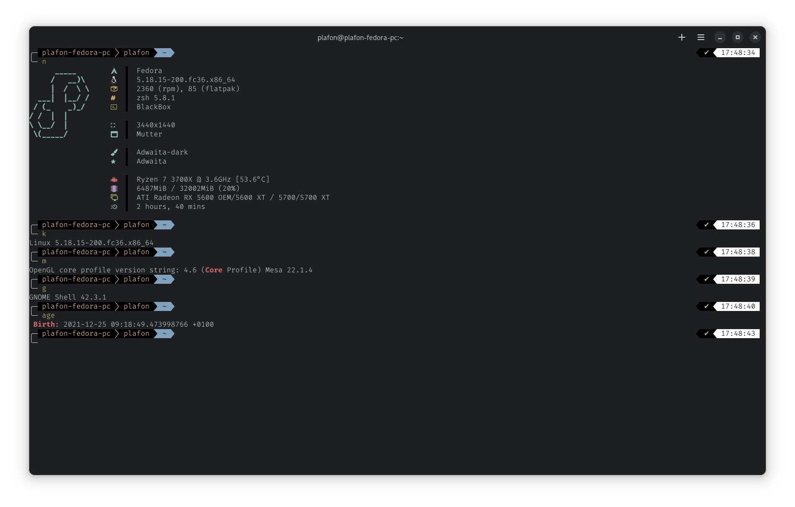

# Алиасы

## Добавляем Alias (сокращенные команды)

<figure><figcaption></figcaption></figure>

```bash
    #
    # Timeshift
    #
    alias tm="sudo timeshift"
    alias tmc="sudo timeshift --create"
    alias tmd="sudo timeshift --delete"
    alias tmda="sudo timeshift --delete-all"
    alias tml="sudo timeshift --list"
    #
    # Neofetch
    #
    alias n="neofetch"
    alias k="uname -rs"
    alias g="gnome-shell --version"
    alias f="lsb_release -sd"
    alias m="inxi -G |grep Mesa"
    alias age="stat / | grep "Birth""
    alias ram="sudo dmidecode -t memory | grep Speed"
    alias cpu="lscpu | grep Model"
    alias cpuc="lscpu"
    alias w="wine --version"
    alias pc="inxi -Ixxx"
    alias net="inxi -Nxxx"
    #
    # DNF
    #
    alias up="sudo dnf upgrade --refresh --best --allowerasing -y && flatpak update -y"
    alias clean="sudo dnf autoremove -y && dnf clean all && flatpak uninstall --unused -y && sudo journalctl --vacuum-time=1weeks"
    alias dnfr="sudo dnf autoremove"
    alias dnfs="dnf search"
    alias dnfi="sudo dnf install"
    #
    # PC
    #
    alias son="sudo systemctl suspend"
    alias logout="loginctl terminate-user plafon"
    alias krista="up && clean && son"
    alias plafon="up && clean && clear && n"
    alias ls="ls --color"
    alias l="lsd --date '+%d.%m.%Y %H:%M' -lah"
    #
    # Flatpak
    #
    alias fli="flatpak install --noninteractive -y flathub"
    alias flr="flatpak remove --noninteractive -y"
    alias fr="flatpak repair"
    alias fl="flatpak list"
    #
    #
    #
    alias gte="gnome-text-editor"
```

