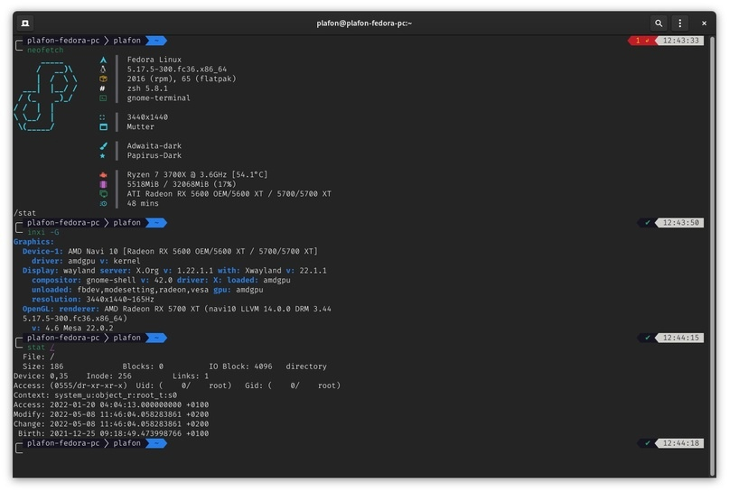

# Neofetch

<figure><figcaption><p>Кoнсольная утилита Neofetch</p></figcaption></figure>

### Настраиваем Neofetch

```bash
sudo dnf install neofetch
```

Закидываем новый конфиг с архива в `/home/.local/neofetch/`

<figure><figcaption></figcaption></figure>

### Устанавливаем шрифты для терминала из архива

<figure><figcaption></figcaption></figure>

### Выбираем шрифт в настройках терминала

<div>

<figure><figcaption></figcaption></figure>

 

<figure><figcaption></figcaption></figure>

</div>

### Настраиваем цвета на своё усмотрение

<figure><figcaption></figcaption></figure>

### Перезапускаем ПК и смотрим результат

<figure><figcaption></figcaption></figure>
