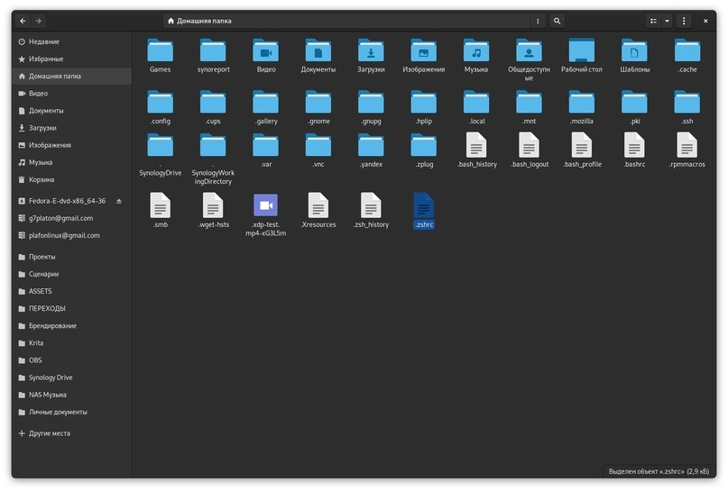

# Терминал на ZSH


Большая благодарность автору канала [`Toxblh. Не только Linux`](https://t.me/toxblh\_linux) за предоставленный гайд и сорсы.




### Качаем архив с конфигами и шрифтами:&#x20;



### Закидываем .zshrc в папку /home

<figure><figcaption></figcaption></figure>

### Устанавливаем ZSH в Fedora Linux

```bash
sudo dnf install zsh
```

### Делаем ZSH по умолчанию для нашего терминала:

```bash
grep tecmint /etc/passwd
```

```bash
chsh -s $(which zsh)
```

```bash
grep tecmint /etc/passwd
```


Перезапускаем ПК


```bash
zsh
```
