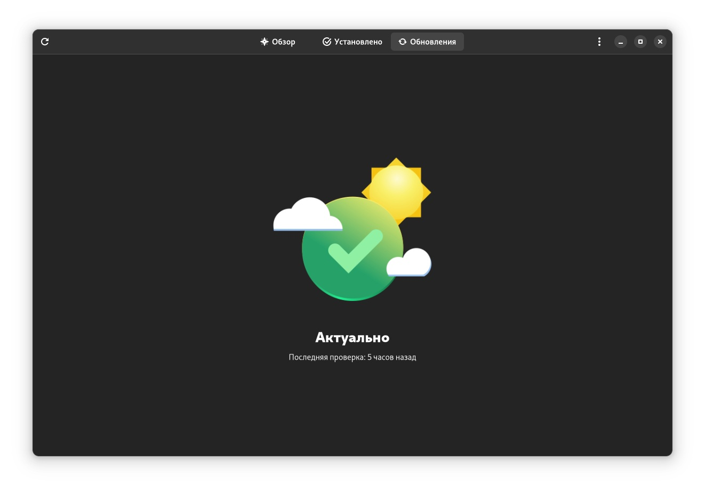
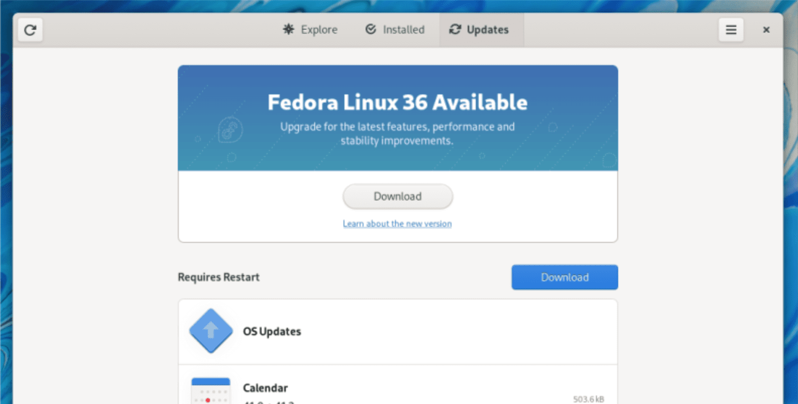

# Обновление системы

Для полного обновления системы выполняем команду в терминале (CTRL+ALT+T):

```bash
sudo dnf upgrade --refresh
```


Тем не менее, команда Fedora Linux рекомендует обновляться штатным способом через магазин приложений Gnome Software.


<figure><figcaption><p>Gnome Software на Fedora Linux</p></figcaption></figure>

### Можно ли обновляться "через версию"?


Официально поддерживается лишь обновление с текущей на следующую версию. Если требуется выполнить обновление сразу через несколько релизов дистрибутива, то настоятельно рекомендуется делать это последовательно (например F27 -> F28 -> F29 -> F30 и т.д.).

В любом случае, можно обновляться через релиз, как показала практика нет никаких проблем с этим.


### При каждом релизе нужно ставить всё с нуля?


Нет! Конечно-же нет! На момент официального релиза, в ваш магазин приложений, в раздел "Обновления" прилетит банер с предложением обновиться до самой новой версии Fedora. Обновляться сразу не обязательно!


<figure><figcaption><p>Обновление с релиза на релиз в Fedora Linux</p></figcaption></figure>

### Какой цикл обновлений у Fedora Linux?


Цикл обновлений у Fedora Linux составляет от 6 до 8 месяцев, при этом как говорилось выше, необязательно обновляться с версию на версию, можно делать это поэтапно, либо через версию.&#x20;

Даже если вы не обновитесь на самую актуальную версию, обновления безопасности и ваших приложений, будут приходить в штатном режиме.

