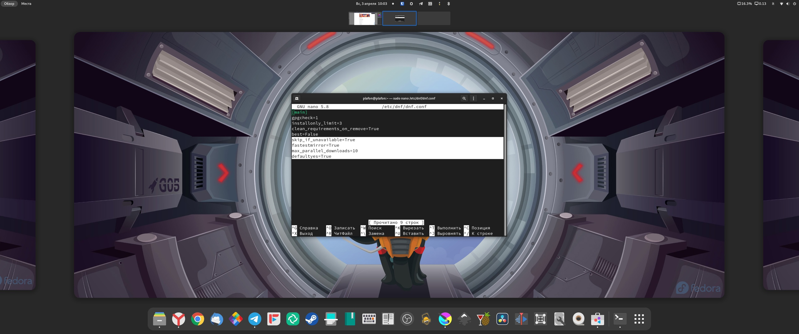

# Ускоряем DNF


**DNF** - _пакетный менеджер для дистрибутива Fedora Linux и его производных. Как, например apt для Debian/Ubuntu или pacman для Arch Linux. В Fedora нельзя использовать другие пакетные менеджеры, только dnf._


<figure><figcaption><p>Ускоряем dnf на Fedora Linux</p></figcaption></figure>

В терминале (CTRL+ALT+T) выполняем:

```bash
sudo gnome-text-editor /etc/dnf/dnf.conf
```

и вставляем отсутвующие параметры:

```bash
[main]
gpgcheck=True
installonly_limit=3
clean_requirements_on_remove=True
best=False
skip_if_unavailable=True
fastestmirror=True
max_parallel_downloads=10
defaultyes=True
keepcache=True

```


Для жителей РФ и СНГ параметр `fastestmirror=True` нужно попробовать включить и отключить и посмотреть как будет лучше. Некоторые пользователи заметили, что dnf пытается подключаться к серверам Yandex, а какие-то пакеты там могут отсутствовать и поэтому могут сыпаться различные ошибки.


Далее выполняем:

```bash
sudo dnf autoremove && sudo dnf clean all
```

### Добавляем автоматическое обновление зеркал в фоне (по идеи должно ускорить dnf)

```bash
sudo dnf install dnf-automatic
```

```bash
sudo systemctl enable dnf-automatic.timer
```
