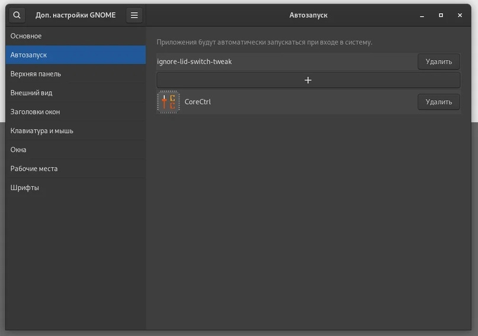
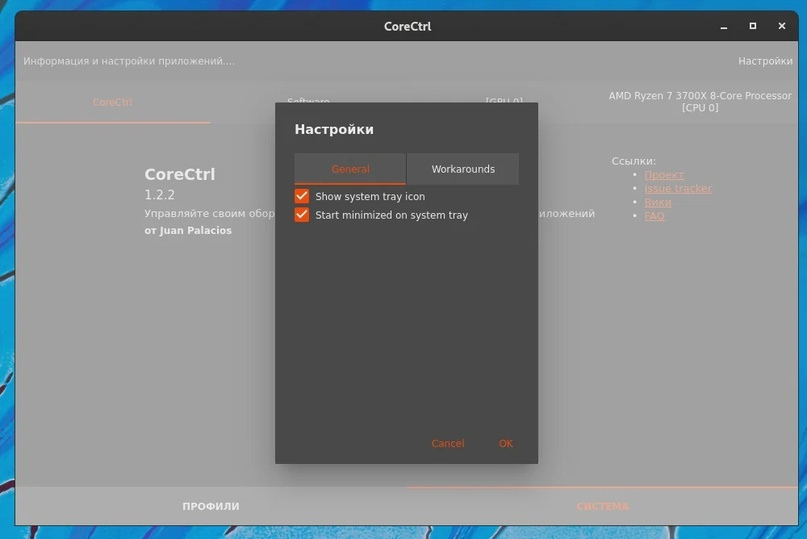

# Утилита CoreCtrl

<figure><figcaption></figcaption></figure>

```bash
sudo dnf install corectrl
```

### Отключаем постоянные запросы пароля

```bash
sudo gnome-text-editor /etc/polkit-1/rules.d/90-corectrl.rules
```

и вставляем это:

```bash
polkit.addRule(function(action, subject) {
    if ((action.id == "org.corectrl.helper.init" ||
         action.id == "org.corectrl.helperkiller.init") &&
        subject.local == true &&
        subject.active == true &&
        subject.isInGroup("your-user-group")) {
            return polkit.Result.YES;
    }
});

```

Меняем `your-user-group` на имя пользователя в системе и сохраняем всё:


Перезагружаем ПК


### Настраиваем автозапуск CoreCtrl

<div>

<figure><figcaption></figcaption></figure>

 

<figure><figcaption></figcaption></figure>

</div>
