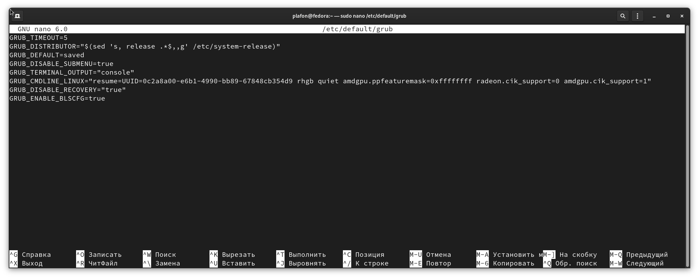

# Разгон видеокарты AMD

<figure><figcaption><p>CoreCTRL</p></figcaption></figure>

`amdgpu.ppfeaturemask=0xffffffff`

`radeon.cik_support=0 amdgpu.cik_support=1`

Параметры выше, нужно добавить через пробел в `/etc/default/grub`

```bash
sudo gnome-text-editor /etc/default/grub
```

Должно получится примерно так (_**кавычки важны!**_):

```bash
GRUB_CMDLINE_LINUX="ваши_параметры amdgpu.ppfeaturemask=0xffffffff radeon.cik_support=0 amdgpu.cik_support=1"
```

<figure><figcaption></figcaption></figure>


Далее CTRL+O, ENTER, CTRL+X


И пересобираем GRUB чтобы закрепить новые параметры, командой:

```bash
sudo grub2-mkconfig -o /boot/grub2/grub.cfg
```
