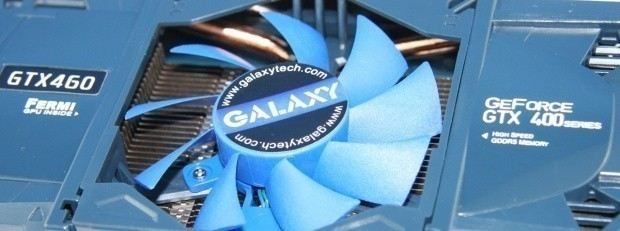

# Для более "старых" Nvidia


Не существует какого-то "упрощенного" метода для установки драйверов Nvidia версий 340 и 390. Таким образом была составлена данная инструкция!



**ПРЕДУПРЕЖДАЕМ!!! Wayland сессия не будет доступна**



Об 3D ускорении графики в таких проектах, как Wine, Proton и Bottles можно увы позабыть.


<figure><figcaption></figcaption></figure>

## Подключаем репозиторий RPM Fusion

```bash
sudo dnf install https://download1.rpmfusion.org/free/fedora/rpmfusion-free-release-$(rpm -E %fedora).noarch.rpm
```

```bash
sudo dnf install https://download1.rpmfusion.org/nonfree/fedora/rpmfusion-nonfree-release-$(rpm -E %fedora).noarch.rpm
```

## Установка 390 версии драйвера


Для видеокарт GeForce 400/500 и частично 600 серии


```bash
sudo dnf install xorg-x11-drv-nvidia-390xx akmod-nvidia-390xx
```


Перезагружаем ПК


## Установка 340 версии драйвера


Для видеокарт GeForce 8/9/200/300 серий


```bash
sudo dnf install xorg-x11-drv-nvidia-340xx akmod-nvidia-340xx
```


Перезагружаем ПК

