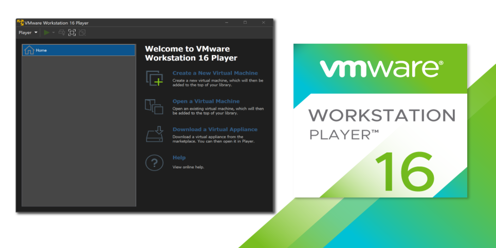

# VMVare Workstation Play

## Скачиваем VMVare Workstation

<figure><figcaption><p>VMVare Workstation Player</p></figcaption></figure>



```bash
sudo bash ./VMware-Player-Full-16.2.4-20089737.x86_64.bundle --eulas-agreed --required
```

```bash
sudo vmware-modconfig --console --install-all
```

Второй метод:

```bash
wget https://github.com/mkubecek/vmware-host-modules/archive/workstation-16.2.1.tar.gz
```

```bash
tar -xzf workstation-16.2.1.tar.gz
```

```bash
cd vmware-host-modules-workstation-16.2.1
```

```bash
tar -cf vmmon.tar vmmon-only
```

```bash
tar -cf vmnet.tar vmnet-only
```

```bash
sudo cp -v vmmon.tar vmnet.tar /usr/lib/vmware/modules/source/
```

```bash
sudo vmware-modconfig --console --install-all
```
