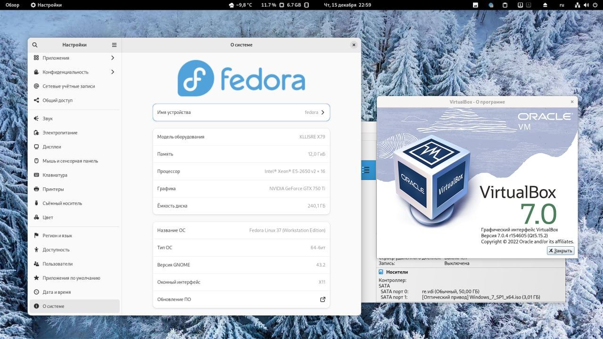

# Virtual Box

<figure><figcaption></figcaption></figure>

```bash
wget https://download.virtualbox.org/virtualbox/7.0.4/VirtualBox-7.0.4-154605-Linux_amd64.run
```

```bash
chmod a+x VirtualBox-7.0.4-154605-Linux_amd64.run
```

```bash
sudo VirtualBox-7.0.4-154605-Linux_amd64.run
```

```bash
sudo usermod -aG vboxusers USER
```
